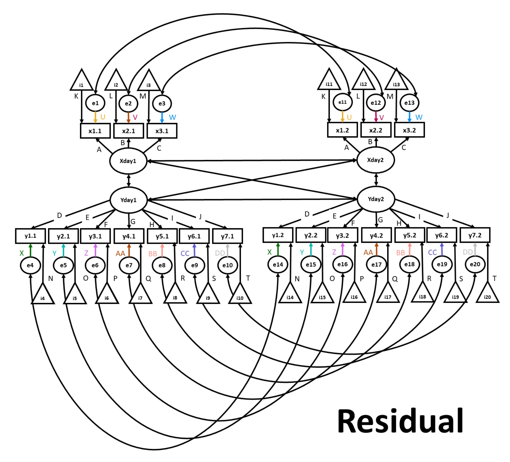
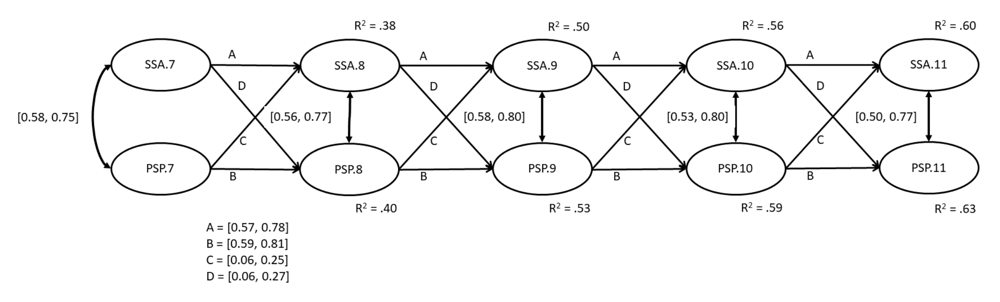
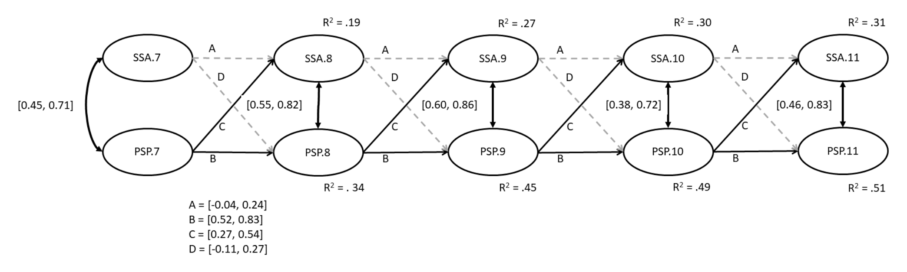

# Invarianza fattoriale nei modelli LGM 

```{r, include = FALSE}
source("_common.R")
library("lavaan")
library("semPlot")
library("knitr")
library("markdown")
library("patchwork")
```

Quando studiamo la variazione dei costrutti nel tempo, amministriamo ripetutamente gli stessi strumenti di misura. Per potere fare affermazioni su come le variabili latenti cambiano nel tempo, è tuttavia prima necessario stabilire che lo strumento utilizzato sia in grado di misurare in maniera invariante il costrutto nel tempo. L'invarianza della misurazione (MI) è confermata in uno studio quando "i partecipanti in tutti i [periodi di tempo] interpretano le singole domande, nonché il fattore latente sottostante, allo stesso modo" [@schoot2015measurement]. Se l'invarianza della misurazione non viene rispettata, la natura del costrutto latente cambia nel tempo, e ciò impedisce di potere eseguire dei confronti tra le diverse rilevazioni temporali. Il problema fondamentale nella misurazione longitudinale è che il semplice passare del tempo (o l'atto di osservare i propri pensieri attraverso misurazioni ripetute) a volte può cambiare il modo in cui i partecipanti interpretano gli item del questionario. Per fare confronti temporali è dunque necessario che la natura del costrutto non sia cambi sostanzialmente nel corso del tempo.

Per utilizzare la CFA per testare la MI, i ricercatori eseguono una serie di confronti tra modelli nidificati, ovvero confrontando tra loro una serie di modelli CFA dotati di vincoli sempre più stringenti relativi alle caratteristiche del modello in relazione al tempo. Modelli più restrittivi e parsimoniosi consentono ad un numero minore di parametri di variare in funzione del tempo per lo stesso costrutto latente. In generale, i parametri considerati sono: 
- le saturazioni fattoriali, che mostrano quanto sia rappresentativo ogni item rispetto al fattore latente su cui satura; 
- le intercette, che descrivono il livello medio di ciascuna item; 
- le varianze residue, che rappresentano l'influenza di altri fattori non inclusi nel modello nel determinare delle risposte agli item, al di là dell'effetto delle variabili latenti considerate. 

Il modello più parsimonioso che mantiene adeguati indici di adattamento determina il livello di invarianza fattoriale.

Possiamo distinguere quattro livelli di invarianza temporale dei costrutti. 

- Il livello di invarianza meno rigoroso, denominato *invarianza configurale*, consente alle saturazioni fattoriali, alle intercette degli item e alle varianze residue di variare tra le diverse rilevazioni temporali (waves). Ciò significa che a tutte le rilevazioni (waves) si applica la stessa struttura fattoriale (cioè, lo stesso numero di variabili latenti con gli stessi item che saturano su ciascun fattore). 
- Il livello successivo è l'*invarianza metrica*, a volte chiamata debole, la quale vincola le saturazioni fattoriali ad essere uguali nelle successive rilevazioni temporali (waves). In base a tale invarianza, gli item non diventano più (o meno) rappresentativi del costrutto latente in rilevazioni temporali successive. 
- Il livello seguente è l'*invarianza scalare* il quale vincola non solo le saturazioni fattoriali, ma anche le intercette degli item, a rimanere costanti nel tempo. Il vincolo sulle intercette stabilisce che il livello medio degli item rimane invariato nel tempo. Se l'invarianza scalare viene violata, ciò significa che l'interpretazione del valore assoluto del punteggio del test cambia con il passare del tempo. È come dire che 100 euro oggi non hanno lo stesso valore di 10 anni fa. Usando un esempio psicologico, una mancanza di invarianza scalare potrebbe suggerire che le medie stiano aumentando nel tempo quando invece quello che veramente succede è che l'interpretazione che i partecipanti assegnano alla scala di risposta cambia nel tempo. 
- Il livello finale è l'*invarianza residua* la quale vincola le saturazioni fattoriali, le intercette degli item e le varianze residue a rimanere uguali nel tempo. Imporre un vincolo sulla variazione delle varianze residue tra le diverse rilevazioni temporali equivale ad affermare che tutti i fattori esterni non misurati che influenzano il costrutto latente non variano nel tempo.

L'invarianza fattoriale temporale è importante perché, se viene violata, i ricercatori possono interpretare erroneamente le cause soggiacenti agli effetti osservati. Ad esempio, uno studio di @twenge2009narcissism ha concluso che i livelli di narcisismo sono aumentati tra il 1990 e il 2010. In seguito, @wetzel2017narcissism hanno esaminato l'invarianza temporale di misurazione nei dati di @twenge2009narcissism e hanno trovato che, in diversi aspetti della *Narcissistic Personality Inventory* [la scala usata da @twenge2009narcissism], essa veniva violata. Tenendo conto di questa parziale non equivalenza di misurazione, @wetzel2017narcissism hanno concluso che, in realtà, il narcisismo degli adolescenti è diminuito nel tempo. Il controllo dell'invarianza temporale di misurazione è quindi una pratica importante preliminarmente all'interpretazione dei risultati degli studi longitudinali.

## Studi longitudinali cross-lagged

Un aspetto importante degli studi longitudinali sono *gli effetti direzionali tra le variabili nel tempo*. Per studiare le iterazioni temporali tra le variabili, i ricercatori possono utilizzare i *cross-lagged panel models* (CLPM). Rispetto agli scudi trasversali, i modelli CLPM possono contribuire a chiarire la direzione delle relazioni causali, in quanto, nei disegni longitudinali, la precedenza temporale è certa. 

### Invarianza di misura in studi longitudinali cross-lagged

Esamineremo qui uno studio di Mackinnon and Curtis (in press). I dati esaminati dai ricercatori derivano da uno studio longitudinale di 21 giorni che indaga il perfezionismo, le motivazioni al consumo di alcol e i problemi legati all'alcol. Le principali variabili latenti di interesse sono le seguenti:

- auto-presentazione perfezionistica (PSP), che misura il desiderio di un individuo di nascondere le proprie imperfezioni;
- l'ansia sociale di stato (SSA), che misura i sentimenti transitori di ansia associati a situazioni sociali. 

Per facilitare la descrizione del modello, Mackinnon and Curtis si concentrano solo su 5 dei 20 giorni in cui sono stati misurati l'auto-presentazione perfezionistica e l'ansia sociale (arbitrariamente, i giorni 7-11). Nell'esempio qui discusso, l'analisi statistica procede, in primo luogo, mediante il test dell'invarianza della misurazione longitudinale relativamente ai 5 giorni considerati e, in seguito, con la verifica delle ipotesi del modello cross-lagged panel.

## Data set

I dati esaminati contengono le risposte fornite da 251 partecipanti su due variabili latenti (scala PSP, composta da tre item, e scala SSA, composta da sette item). Le rilevazioni riguardano cinque giorni successivi (dal giorno sette al giorno undici nello studio originario). Gli item PSP sono stati misurati utilizzando una scala a 7 punti (da 1 a 7); gli item SSA sono stati misurati utilizzando una scala a 5 punti (da 0 a 4).

## Stretegia analitica

L'obiettivo dell'analisi è quello di confrontare, mediante la CFA, varie versioni nidificate del modello CLPM, per determinare la forma più appropriata del modello strutturale finale. Come in precedenza, cerchiamo il modello più semplice (ovvero il modello che stima il minor numero di parametri) che mantiene un buon adattamento ai dati.

L'approccio seguito da Mackinnon e Curtis prevede cinque fasi. 

- Test del modello configurale; 
- test del modello metrico; 
- test del modello scalare;
- test del modello che richiede l'eguaglianza dei termini d'errore; 
- test del modello strutturale. 

In particolare, le prime quattro verifiche si basano sull'analisi delle covarianze (~~) tra le variabili. Nella quinta verifica, un modello CLPM esamina invece le regressioni (~), ovvero le relazioni causali direzionali in funzione del tempo -- ad esempio, i dati del giorno 7 vengono usati per prevedere i dati del giorno 8. 

## Leggere in dati in $\mathsf{R}$

Leggiamo i dati in $\mathsf{R}$.

```{r}
load(here::here("code", "meas_inv_lgm", "my_CLPM_work_space.v4.RData"))
```

```{r}
model.test.dat <- read.csv(
  here::here("code", "meas_inv_lgm", "Abridged Comp Data.csv"),
  header = TRUE,
  sep = ","
)
```

## Struttura degli errori

Mackinnon e Curtis creano uno script separato che contiene la specificazione della struttura dei termini d'errore, che è complessa. Poiché il codice necessario occupa così tante righe, viene scritto separatamente e richiamato poi nella sintassi dei modelli che vengono definiti in seguito. Questo rende il codice più ordinato e più breve. Si noti che il codice seguente impone il vincolo dell'eguaglianza delle covarianze tra i termini d'errore di rilevazioni temporali successive. 

```{r errorstructure}
# Error term covariances constrained across waves
errorstructure <- '
psp1.7  ~~ psp1cov*psp1.8
psp1.7  ~~ psp1cov*psp1.9
psp1.7  ~~ psp1cov*psp1.10
psp1.7  ~~ psp1cov*psp1.11
psp1.8  ~~ psp1cov*psp1.9
psp1.8  ~~ psp1cov*psp1.10
psp1.8  ~~ psp1cov*psp1.11
psp1.9  ~~ psp1cov*psp1.10
psp1.9  ~~ psp1cov*psp1.11
psp1.10 ~~ psp1cov*psp1.11

psp2.7  ~~ psp2cov*psp2.8
psp2.7  ~~ psp2cov*psp2.9
psp2.7  ~~ psp2cov*psp2.10
psp2.7  ~~ psp2cov*psp2.11
psp2.8  ~~ psp2cov*psp2.9
psp2.8  ~~ psp2cov*psp2.10
psp2.8  ~~ psp2cov*psp2.11
psp2.9  ~~ psp2cov*psp2.10
psp2.9  ~~ psp2cov*psp2.11
psp2.10 ~~ psp2cov*psp2.11

psp3.7  ~~ psp3cov*psp3.8
psp3.7  ~~ psp3cov*psp3.9
psp3.7  ~~ psp3cov*psp3.10
psp3.7  ~~ psp3cov*psp3.11
psp3.8  ~~ psp3cov*psp3.9
psp3.8  ~~ psp3cov*psp3.10
psp3.8  ~~ psp3cov*psp3.11
psp3.9  ~~ psp3cov*psp3.10
psp3.9  ~~ psp3cov*psp3.11
psp3.10 ~~ psp3cov*psp3.11

ssa1.7  ~~ ssa1cov*ssa1.8
ssa1.7  ~~ ssa1cov*ssa1.9
ssa1.7  ~~ ssa1cov*ssa1.10
ssa1.7  ~~ ssa1cov*ssa1.11
ssa1.8  ~~ ssa1cov*ssa1.9
ssa1.8  ~~ ssa1cov*ssa1.10
ssa1.8  ~~ ssa1cov*ssa1.11
ssa1.9  ~~ ssa1cov*ssa1.10
ssa1.9  ~~ ssa1cov*ssa1.11
ssa1.10 ~~ ssa1cov*ssa1.11

ssa2.7  ~~ ssa2cov*ssa2.8
ssa2.7  ~~ ssa2cov*ssa2.9
ssa2.7  ~~ ssa2cov*ssa2.10
ssa2.7  ~~ ssa2cov*ssa2.11
ssa2.8  ~~ ssa2cov*ssa2.9
ssa2.8  ~~ ssa2cov*ssa2.10
ssa2.8  ~~ ssa2cov*ssa2.11
ssa2.9  ~~ ssa2cov*ssa2.10
ssa2.9  ~~ ssa2cov*ssa2.11
ssa2.10 ~~ ssa2cov*ssa2.11

ssa3.7  ~~ ssa3cov*ssa3.8
ssa3.7  ~~ ssa3cov*ssa3.9
ssa3.7  ~~ ssa3cov*ssa3.10
ssa3.7  ~~ ssa3cov*ssa3.11
ssa3.8  ~~ ssa3cov*ssa3.9
ssa3.8  ~~ ssa3cov*ssa3.10
ssa3.8  ~~ ssa3cov*ssa3.11
ssa3.9  ~~ ssa3cov*ssa3.10
ssa3.9  ~~ ssa3cov*ssa3.11
ssa3.10 ~~ ssa3cov*ssa3.11

ssa4.7  ~~ ssa4cov*ssa4.8
ssa4.7  ~~ ssa4cov*ssa4.9
ssa4.7  ~~ ssa4cov*ssa4.10
ssa4.7  ~~ ssa4cov*ssa4.11
ssa4.8  ~~ ssa4cov*ssa4.9
ssa4.8  ~~ ssa4cov*ssa4.10
ssa4.8  ~~ ssa4cov*ssa4.11
ssa4.9  ~~ ssa4cov*ssa4.10
ssa4.9  ~~ ssa4cov*ssa4.11
ssa4.10 ~~ ssa4cov*ssa4.11

ssa5.7  ~~ ssa5cov*ssa5.8
ssa5.7  ~~ ssa5cov*ssa5.9
ssa5.7  ~~ ssa5cov*ssa5.10
ssa5.7  ~~ ssa5cov*ssa5.11
ssa5.8  ~~ ssa5cov*ssa5.9
ssa5.8  ~~ ssa5cov*ssa5.10
ssa5.8  ~~ ssa5cov*ssa5.11
ssa5.9  ~~ ssa5cov*ssa5.10
ssa5.9  ~~ ssa5cov*ssa5.11
ssa5.10 ~~ ssa5cov*ssa5.11

ssa6.7  ~~ ssa6cov*ssa6.8
ssa6.7  ~~ ssa6cov*ssa6.9
ssa6.7  ~~ ssa6cov*ssa6.10
ssa6.7  ~~ ssa6cov*ssa6.11
ssa6.8  ~~ ssa6cov*ssa6.9
ssa6.8  ~~ ssa6cov*ssa6.10
ssa6.8  ~~ ssa6cov*ssa6.11
ssa6.9  ~~ ssa6cov*ssa6.10
ssa6.9  ~~ ssa6cov*ssa6.11
ssa6.10 ~~ ssa6cov*ssa6.11

ssa7.7  ~~ ssa7cov*ssa7.8
ssa7.7  ~~ ssa7cov*ssa7.9
ssa7.7  ~~ ssa7cov*ssa7.10
ssa7.7  ~~ ssa7cov*ssa7.11
ssa7.8  ~~ ssa7cov*ssa7.9
ssa7.8  ~~ ssa7cov*ssa7.10
ssa7.8  ~~ ssa7cov*ssa7.11
ssa7.9  ~~ ssa7cov*ssa7.10
ssa7.9  ~~ ssa7cov*ssa7.11
ssa7.10 ~~ ssa7cov*ssa7.11'
```

## Modello configurale 

### Definizione del modello

In primo luogo, desideriamo stabilire l'invarianza configurale, che funge da modello di confronto per valutare l'invarianza temporale della misurazione. In tutti i nostri modelli, iniziamo definendo le saturazioni fattoriali sulle variabili latenti. Per impostazione predefinita in lavaan, la saturazione del primo indicatore per ciascuna variabile latente viene normalmente vincolata a 1, mentre la varianza di ciascuna variabile latente non viene vincolata. Tuttavia, poiché ciò renderebbe più scomodi i passaggi successivi (ad es. Invarianza metrica), imponiamo invece ad 1 la varianza di ciascuna variabile latente (ad es. `PSP.7 ~~ 1*PSP.7`), consentendo così alla saturazione del primo item di variare liberamente (ad es. `NA*psp1.7`).

Da notare anche l'uso del comando `paste`, che unisce due stringhe di testo (il modello e la struttura degli errori). Questo di solito non è necessario per i modelli `lavaan`, ma accorcerà il nostro codice data la struttura dell'errore estremamente complicata.

Nella figura \@ref(fig:configural), gli ovali rappresentano le variabili latenti. I rettangoli etichettati rappresentano gli item misurati, con le corrispondenti saturazioni fattoriali mostrate come frecce che originano dalle variabili latenti. I triangoli rappresentano le intercette degli item e i cerchi rappresentano i residui. Le frecce a due punte rappresentano le covarianze. Nel modello configurazionale, abbiamo consentito che le saturazioni fattoriali, le intercette degli item e le varianze residue possano variare liberamente tra le successive rilevazioni temporali. Il modello utilizzato nel tutorial considera i dati di 5 giorni; per semplicità, figura \@ref(fig:configural) mostra solo i primi due giorni.

```{r configural, echo=FALSE, fig.cap='Invarianza configurale.', out.width = '70%'}
knitr::include_graphics("code/meas_inv_lgm/configural.png")
```

```{r configuraldefinition}
configural.v1 <-
'
# PSP factor loadings defined
PSP.7  =~ NA*psp1.7 + psp2.7 + psp3.7
PSP.8  =~ NA*psp1.8 + psp2.8 + psp3.8
PSP.9  =~ NA*psp1.9 + psp2.9 + psp3.9
PSP.10 =~ NA*psp1.10 + psp2.10 + psp3.10
PSP.11 =~ NA*psp1.11 + psp2.11 + psp3.11

# PSP variance constrained to 1
PSP.7  ~~ 1*PSP.7
PSP.8  ~~ 1*PSP.8
PSP.9  ~~ 1*PSP.9
PSP.10 ~~ 1*PSP.10
PSP.11 ~~ 1*PSP.11

# SSA factor loadings defined
SSA.7  =~ NA*ssa1.7 + ssa2.7 + ssa3.7 + ssa4.7 + ssa5.7 + ssa6.7 + ssa7.7
SSA.8  =~ NA*ssa1.8 + ssa2.8 + ssa3.8 + ssa4.8 + ssa5.8 + ssa6.8 + ssa7.8
SSA.9  =~ NA*ssa1.9 + ssa2.9 + ssa3.9 + ssa4.9 + ssa5.9 + ssa6.9 + ssa7.9
SSA.10 =~ NA*ssa1.10 + ssa2.10 + ssa3.10 + ssa4.10 + ssa5.10 + ssa6.10 + ssa7.10
SSA.11 =~ NA*ssa1.11 + ssa2.11 + ssa3.11 + ssa4.11 + ssa5.11 + ssa6.11 + ssa7.11

# SSA variance constrained to 1
SSA.7  ~~ 1*SSA.7
SSA.8  ~~ 1*SSA.8
SSA.9  ~~ 1*SSA.9
SSA.10 ~~ 1*SSA.10
SSA.11 ~~ 1*SSA.11
'

configural.model <- paste(
  configural.v1, 
  errorstructure, 
  sep = ' ', 
  collapse = NULL
)
```

### Output del modello

Dopo avere definito il modello, lo adattiamo ai dati. Per questa e tutte le analisi successive, aggiungiamo la riga `std.lv = TRUE` per tenere conto della nostra modifica alle impostazioni sui vincoli dei default di `lavaan` allo scopo di garantire l'identificabilità del modello. Esaminiamo i risultati con `summary()`.

```{r configuraloutput}
configural.fit <- cfa(configural.model,
  data = model.test.dat,
  estimator = "MLR",
  se = "robust",
  missing = "ML",
  std.lv = TRUE
)

summary(configural.fit,
  fit.measures = TRUE,
  standardized = TRUE,
  ci = TRUE,
  rsquare = TRUE
)
```

### Interpretazione

Dopo avere costruito il modello "baseline" passiamo a introdurre progressivamente dei vincoli aggiuntivi per poi procedere al confronto tra le versioni nidificate dei modelli proposti. Dopo aver adattato tutti i modelli, il modello più appropriato verrà selezionato mediante il confronto tra gli indici di bontà di adattamento. 

## Invarianza metrica

Esaminiamo ora l'invarianza metrica. 

### Definizione del modello

In questo modello, oltre ai vincoli dell'invarianza configurale, viene imposto il vincolo dell'eguaglianza delle saturazioni di ciascuna rilevazione temporale. Questo viene ottenuto applicando una singola etichetta a tutte e cinque le iterazioni degli item che saturano su ciascun fattore (ad es.,, l'etichetta `psp1f*` viene applicata a tutte e cinque le iterazioni di `psp1`). 

```{r configuralfig, echo=FALSE, fig.cap='Invarianza metrica.', out.width = '70%'}
knitr::include_graphics("code/meas_inv_lgm/metric.png")
```

```{r metricdefinition}
metric.v1 <-
'
# PSP factor loadings defined, and constrained across waves
PSP.7  =~ psp1f*psp1.7 + psp2f*psp2.7 + psp3f*psp3.7
PSP.8  =~ psp1f*psp1.8 + psp2f*psp2.8 + psp3f*psp3.8
PSP.9  =~ psp1f*psp1.9 + psp2f*psp2.9 + psp3f*psp3.9
PSP.10 =~ psp1f*psp1.10 + psp2f*psp2.10 + psp3f*psp3.10
PSP.11 =~ psp1f*psp1.11 + psp2f*psp2.11 + psp3f*psp3.11

# PSP variance constrained to 1
PSP.7  ~~ 1*PSP.7
PSP.8  ~~ 1*PSP.8
PSP.9  ~~ 1*PSP.9
PSP.10 ~~ 1*PSP.10
PSP.11 ~~ 1*PSP.11

# SSA factor loadings defined, and constrained across waves
SSA.7 =~ ssa1f*ssa1.7 + ssa2f*ssa2.7 + ssa3f*ssa3.7 + 
         ssa4f*ssa4.7 + ssa5f*ssa5.7 + ssa6f*ssa6.7 + ssa7f*ssa7.7
         
SSA.8 =~ ssa1f*ssa1.8 + ssa2f*ssa2.8 + ssa3f*ssa3.8 + 
         ssa4f*ssa4.8 + ssa5f*ssa5.8 + ssa6f*ssa6.8 + ssa7f*ssa7.8
         
SSA.9 =~ ssa1f*ssa1.9 + ssa2f*ssa2.9 + ssa3f*ssa3.9 + 
         ssa4f*ssa4.9 + ssa5f*ssa5.9 + ssa6f*ssa6.9 + ssa7f*ssa7.9
         
SSA.10 =~ ssa1f*ssa1.10 + ssa2f*ssa2.10 + ssa3f*ssa3.10 + 
          ssa4f*ssa4.10 + ssa5f*ssa5.10 + ssa6f*ssa6.10 + ssa7f*ssa7.10
          
SSA.11 =~ ssa1f*ssa1.11 + ssa2f*ssa2.11 + ssa3f*ssa3.11 + 
          ssa4f*ssa4.11 + ssa5f*ssa5.11 + ssa6f*ssa6.11 + ssa7f*ssa7.11

# SSA variance constrained to 1
SSA.7  ~~ 1*SSA.7
SSA.8  ~~ 1*SSA.8
SSA.9  ~~ 1*SSA.9
SSA.10 ~~ 1*SSA.10
SSA.11 ~~ 1*SSA.11
'

metric.model <- paste(
  metric.v1, 
  errorstructure, 
  sep = ' ', 
  collapse = NULL
)
```

### Output del modello

Adattiamo il modello. 

```{r metricoutput}
metric.fit <- cfa(metric.model,
  data = model.test.dat,
  estimator = "MLR",
  se = "robust",
  missing = "ML",
  std.lv = TRUE
)
```

Esaminiamo i risultati.

```{r}
summary(metric.fit,
  fit.measures = TRUE,
  standardized = TRUE,
  ci = TRUE,
  rsquare = TRUE
)
```

## Invarianza scalare

Esaminiamo il modello di invarianza scalare.

### Definizione del modello

In questo modello, oltre ai vincoli applicati al modello metrico, fissiamo le intercette degli item in maniera tale che siano uguali in ciascuna rilevazione temporale. Come con il modello metrico, questo risultato viene ottenuto applicando una singola etichetta a tutte e cinque le iterazioni dell'intercetta di un item nel tempo (ad es. `psp1.7 ~ psp1i*1`). In questo esempio, "psp1.7" è l'item, "psp1i" è l'etichetta e "*1" indica a `lavaan` di fare riferimento all'intercetta. L'istruzione `paste` aggiunge questi vincoli al modello di invarianza metrica che è stato definito in precedenza.

```{r scalar, echo=FALSE, fig.cap='Invarianza scalare.', out.width = '70%'}

```

```{r scalardefinition}
scalar.v1 <-
'
# Intercepts constrained
psp1.7  ~ psp1i*1
psp1.8  ~ psp1i*1
psp1.9  ~ psp1i*1
psp1.10 ~ psp1i*1
psp1.11 ~ psp1i*1

psp2.7  ~ psp2i*1
psp2.8  ~ psp2i*1
psp2.9  ~ psp2i*1
psp2.10 ~ psp2i*1
psp2.11 ~ psp2i*1

psp3.7  ~ psp3i*1
psp3.8  ~ psp3i*1
psp3.9  ~ psp3i*1
psp3.10 ~ psp3i*1
psp3.11 ~ psp3i*1

ssa1.7  ~ ssa1i*1
ssa1.8  ~ ssa1i*1
ssa1.9  ~ ssa1i*1
ssa1.10 ~ ssa1i*1
ssa1.11 ~ ssa1i*1

ssa2.7  ~ ssa2i*1
ssa2.8  ~ ssa2i*1
ssa2.9  ~ ssa2i*1
ssa2.10 ~ ssa2i*1
ssa2.11 ~ ssa2i*1

ssa3.7  ~ ssa3i*1
ssa3.8  ~ ssa3i*1
ssa3.9  ~ ssa3i*1
ssa3.10 ~ ssa3i*1
ssa3.11 ~ ssa3i*1

ssa4.7  ~ ssa4i*1
ssa4.8  ~ ssa4i*1
ssa4.9  ~ ssa4i*1
ssa4.10 ~ ssa4i*1
ssa4.11 ~ ssa4i*1

ssa5.7  ~ ssa5i*1
ssa5.8  ~ ssa5i*1
ssa5.9  ~ ssa5i*1
ssa5.10 ~ ssa5i*1
ssa5.11 ~ ssa5i*1

ssa6.7  ~ ssa6i*1
ssa6.8  ~ ssa6i*1
ssa6.9  ~ ssa6i*1
ssa6.10 ~ ssa6i*1
ssa6.11 ~ ssa6i*1

ssa7.7  ~ ssa7i*1
ssa7.8  ~ ssa7i*1
ssa7.9  ~ ssa7i*1
ssa7.10 ~ ssa7i*1
ssa7.11 ~ ssa7i*1
'

scalar.model <- paste(
  metric.v1, 
  errorstructure, 
  scalar.v1, 
  sep = ' ', 
  collapse = NULL
)
```

### Output del modello

Adattiamo il modello.

```{r scalaroutput}
scalar.fit <- cfa(scalar.model,
  data = model.test.dat,
  estimator = "MLR",
  se = "robust",
  missing = "ML",
  std.lv = TRUE
)
```

Esaminiamo i risultati.

```{r}
summary(scalar.fit,
  fit.measures = TRUE,
  standardized = TRUE,
  ci = TRUE,
  rsquare = TRUE
)
```

## Invarianza degli errori

Passiamo ora ad applicare l'insieme più stringente di vincoli, ovvero quello dell'invarianza degli errori. 

### Definizione del modello

Nel presente modello, oltre ai vincoli applicati al modello scalare, imponiamo anche il vincolo dell'eguaglianza dei termini d'errore nelle diverse rilevazioni temporali. Ancora una volta, questo risultato viene ottenuto applicando una singola etichetta (ad esempio, `psp1u`) ai gruppi di item che desideriamo vincolare (ad esempio `psp1.7 ~~ psp1u*psp1.7` e `psp1.8 ~~ psp1u*psp1.8`). La sintassi è simile a quella che abbiamo usato in precedenza per le covarianze; tuttavia, in questo caso viene considerata la covariazione di ogni variabile con se stessa. 

```{r residual, echo=FALSE, fig.cap='Invarianza dei termini erratici.', out.width = '70%'}

```

```{r residualdefinition}
residual.v1 <-
'
# Residual error constrained across waves
psp1.7  ~~ psp1u*psp1.7
psp1.8  ~~ psp1u*psp1.8
psp1.9  ~~ psp1u*psp1.9
psp1.10 ~~ psp1u*psp1.10
psp1.11 ~~ psp1u*psp1.11

psp2.7  ~~ psp2u*psp2.7
psp2.8  ~~ psp2u*psp2.8
psp2.9  ~~ psp2u*psp2.9
psp2.10 ~~ psp2u*psp2.10
psp2.11 ~~ psp2u*psp2.11

psp3.7  ~~ psp3u*psp3.7
psp3.8  ~~ psp3u*psp3.8
psp3.9  ~~ psp3u*psp3.9
psp3.10 ~~ psp3u*psp3.10
psp3.11 ~~ psp3u*psp3.11

ssa1.7  ~~ ssa1u*ssa1.7
ssa1.8  ~~ ssa1u*ssa1.8
ssa1.9  ~~ ssa1u*ssa1.9
ssa1.10 ~~ ssa1u*ssa1.10
ssa1.11 ~~ ssa1u*ssa1.11

ssa2.7  ~~ ssa2u*ssa2.7
ssa2.8  ~~ ssa2u*ssa2.8
ssa2.9  ~~ ssa2u*ssa2.9
ssa2.10 ~~ ssa2u*ssa2.10
ssa2.11 ~~ ssa2u*ssa2.11

ssa3.7  ~~ ssa3u*ssa3.7
ssa3.8  ~~ ssa3u*ssa3.8
ssa3.9  ~~ ssa3u*ssa3.9
ssa3.10 ~~ ssa3u*ssa3.10
ssa3.11 ~~ ssa3u*ssa3.11

ssa4.7  ~~ ssa4u*ssa4.7
ssa4.8  ~~ ssa4u*ssa4.8
ssa4.9  ~~ ssa4u*ssa4.9
ssa4.10 ~~ ssa4u*ssa4.10
ssa4.11 ~~ ssa4u*ssa4.11

ssa5.7  ~~ ssa5u*ssa5.7
ssa5.8  ~~ ssa5u*ssa5.8
ssa5.9  ~~ ssa5u*ssa5.9
ssa5.10 ~~ ssa5u*ssa5.10
ssa5.11 ~~ ssa5u*ssa5.11

ssa6.7  ~~ ssa6u*ssa6.7
ssa6.8  ~~ ssa6u*ssa6.8
ssa6.9  ~~ ssa6u*ssa6.9
ssa6.10 ~~ ssa6u*ssa6.10
ssa6.11 ~~ ssa6u*ssa6.11

ssa7.7  ~~ ssa7u*ssa7.7
ssa7.8  ~~ ssa7u*ssa7.8
ssa7.9  ~~ ssa7u*ssa7.9
ssa7.10 ~~ ssa7u*ssa7.10
ssa7.11 ~~ ssa7u*ssa7.11
'

residual.model <- paste(
  metric.v1, 
  errorstructure, 
  scalar.v1, 
  residual.v1, 
  sep = ' ', 
  collapse = NULL
)
```

### Output del modello

Adattiamo il modello.

```{r residualoutput}
residual.fit <- cfa(residual.model,
  data = model.test.dat,
  estimator = "MLR",
  se = "robust",
  missing = "ML",
  std.lv = TRUE
)
```

Esaminiamo i risultati.

```{r}
summary(residual.fit,
  fit.measures = TRUE,
  standardized = TRUE,
  ci = TRUE,
  rsquare = TRUE
)
```

## Confronto tra modelli

Passiamo ora al confronto tra i vari modelli di invarianza temporale di misurazione.

### Codice e output

Usiamo il codice seguente per confrontare gli indici di adattamento dei quattro modelli descritti in precedenza.

```{r cfacomparison}
round(cbind(
  configural.error = inspect(configural.fit, "fit.measures"),
  metric = inspect(metric.fit, "fit.measures"),
  scalar = inspect(scalar.fit, "fit.measures"),
  residual = inspect(residual.fit, "fit.measures")
), 3)

anova(configural.fit, metric.fit)
anova(metric.fit, scalar.fit)
anova(scalar.fit, residual.fit)
```

### Interpretazione

In generale, i valori degli indici di bontà dell'adattamento (es. Robust CFI, Robust TLI, AIC, BIC, Robust RMSEA e SRMR) sono simili tra i quattro modelli considerati. In questi termini, per questi dati, l'invarianza della misurazione più restrittiva sembra essere stata confermata. Si può notare, però, che non tutti gli indici di adattamento concordano su quale sia il modello migliore (ad esempio, il test del chi quadrato preferisce il modello metrico)! Nel tutorial, Mackinnon and Curtis non basano la selezione dei modelli usando i risultati del test del rapporto di verosimiglianza, ma preferiscono basarsi sugli altri indici. Questo fa capire quanto sia importante scegliere i criteri di selezione del modello a priori (idealmente, mediante una pre-registrazione dello studio).

Procediamo ora all'analisi SEM utilizzando il modello dell'invarianza dei residui.

## Modello strutturale

Dopo aver selezionato il modello dell'eguaglianza dei residui come il modello preferito (il che potrebbe essere alquanto discutibile, ma qui tale modello è stato scelto a scopo dimostrativo), usiamo il modello selezionato come modello Cross-lagged Panel.

### Definizione del modello

Nel modello Cross-lagged Panel vengono stimati i coefficienti di regressione, non le covarianze. Vengono qui considerate solo le relazioni dal tempo $t$ al tempo $t+1$. Cioè, le relazioni dal tempo $t$ a $t+2$, a $t+3$ e così via vengono omesse. Si potrebbe voler includere anche queste relazioni, ma per i presenti scopi didattici, qui verrà solo esaminato un modello più semplice e verrà imposto il vincolo per cui le relazioni tra variabili con ritardi temporali maggiori di +1 sono uguali a zero.

```{r residualsemdefinition}
sem.v1 <-
'
# Structural paths defined
SSA.8  ~ A*SSA.7 + C*PSP.7
PSP.8  ~ D*SSA.7 + B*PSP.7
SSA.9  ~ A*SSA.8 + C*PSP.8
PSP.9  ~ D*SSA.8 + B*PSP.8
SSA.10 ~ A*SSA.9 + C*PSP.9
PSP.10 ~ D*SSA.9 + B*PSP.9
SSA.11 ~ A*SSA.10 + C*PSP.10
PSP.11 ~ D*SSA.10 + B*PSP.10

# Latent variable covariances defined
SSA.7  ~~ PSP.7
SSA.8  ~~ PSP.8
SSA.9  ~~ PSP.9
SSA.10 ~~ PSP.10
SSA.11 ~~ PSP.11
'

residual.sem.model <- paste(
  residual.model, 
  sem.v1, sep = ' ', 
  collapse = NULL
)
```

### Output del modello

Adattiamo il modello.

```{r residualsemoutput}
residual.sem.fit <- sem(residual.sem.model,
  data = model.test.dat,
  estimator = "MLR",
  se = "robust",
  missing = "ML",
  std.lv = TRUE
)
```

Esaminiamo i risulati.

```{r}
summary(residual.sem.fit,
  fit.measures = TRUE,
  standardized = TRUE,
  ci = TRUE,
  rsquare = TRUE
)
```

Il modello ha un adattamento accettabile. I valori $R^2$ variano da .38 a .63. La figura \@ref(fig:parintclpm) mostra che l'auto-presentazione perfezionistica del giorno precedente predice fortemente l'auto-presentazione perfezionista del giorno successivo. Allo stesso modo, l'ansia sociale del giorno precedente predice fortemente l'ansia sociale del giorno successivo. Nel contempo, il percorso incrociato tra ciascuna variabile latente e la variabile opposta è più debole, anche se non statisticamente nullo. Questo tipo di pattern (grandi percorsi auto-regressivi, piccoli percorsi incrociati) è tipico dei modelli Cross-lagged Panel.

```{r parintclpm, echo=FALSE, fig.cap='Modello Cross-lagged Panel Model.', out.width = '99%'}

```

## Modello Random Intercepts Cross-Lagged Panel 

Una variante del modello descritto in precedenza è il modello Random Intercepts Cross-Lagged Panel proposto da Ellen Hamaker (Hamaker, 2015; Mulder & Hamaker, 2020). 

### Definizione del modello

Questo modello (si veda la figura \@ref(fig:riclpm)) apporta quattro modifiche al modello precedente: 

- viene omessa la struttura residuale correlata; 
- sono specificate intercette casuali per ciascun indicatore; 
- le intercette casuali possono covariare; 
- le medie latenti di tutte le variabili latenti dal secondo momento temporale in poi sono parametri che possono variare liberamente. 

Si noti che il RI-CLPM richiede almeno 3 punti temporali; il diagramma in Figura \@ref(fig:riclpm), su due giorni, viene fornito solo quale esempio, per evitare una eccessiva complessità visiva.

```{r riclpm, echo=FALSE, fig.cap='Random Intercepts Cross-lagged Panel Model.', out.width = '80%'}
knitr::include_graphics("code/meas_inv_lgm/random_intercepts_residual.png")
```

```{r ricpmdefinition}
sem.v2 <-
'
# Create between components (random intercepts)
RI.PSP1 =~ 1*psp1.7 + 1*psp1.8 + 1*psp1.9 + 1*psp1.10 + 1*psp1.11 
RI.PSP2 =~ 1*psp2.7 + 1*psp2.8 + 1*psp2.9 + 1*psp2.10 + 1*psp2.11 
RI.PSP3 =~ 1*psp3.7 + 1*psp3.8 + 1*psp3.9 + 1*psp3.10 + 1*psp3.11 

RI.SSA1 =~ 1*ssa1.7 + 1*ssa1.8 + 1*ssa1.9 + 1*ssa1.10 + 1*ssa1.11 
RI.SSA2 =~ 1*ssa2.7 + 1*ssa2.8 + 1*ssa2.9 + 1*ssa2.10 + 1*ssa2.11 
RI.SSA3 =~ 1*ssa3.7 + 1*ssa3.8 + 1*ssa3.9 + 1*ssa3.10 + 1*ssa3.11 
RI.SSA4 =~ 1*ssa4.7 + 1*ssa4.8 + 1*ssa4.9 + 1*ssa4.10 + 1*ssa4.11 
RI.SSA5 =~ 1*ssa5.7 + 1*ssa5.8 + 1*ssa5.9 + 1*ssa5.10 + 1*ssa5.11 
RI.SSA6 =~ 1*ssa6.7 + 1*ssa6.8 + 1*ssa6.9 + 1*ssa6.10 + 1*ssa6.11 
RI.SSA7 =~ 1*ssa7.7 + 1*ssa7.8 + 1*ssa7.9 + 1*ssa7.10 + 1*ssa7.11 

# PSP factor loadings defined, and constrained across waves
PSP.7  =~ psp1f*psp1.7 + psp2f*psp2.7 + psp3f*psp3.7
PSP.8  =~ psp1f*psp1.8 + psp2f*psp2.8 + psp3f*psp3.8
PSP.9  =~ psp1f*psp1.9 + psp2f*psp2.9 + psp3f*psp3.9
PSP.10 =~ psp1f*psp1.10 + psp2f*psp2.10 + psp3f*psp3.10
PSP.11 =~ psp1f*psp1.11 + psp2f*psp2.11 + psp3f*psp3.11

# PSP variance constrained to 1
PSP.7  ~~ 1*PSP.7
PSP.8  ~~ 1*PSP.8
PSP.9  ~~ 1*PSP.9
PSP.10 ~~ 1*PSP.10
PSP.11 ~~ 1*PSP.11

# SSA factor loadings defined, and constrained across waves
SSA.7 =~ ssa1f*ssa1.7 + ssa2f*ssa2.7 + ssa3f*ssa3.7 + 
         ssa4f*ssa4.7 + ssa5f*ssa5.7 + ssa6f*ssa6.7 + ssa7f*ssa7.7
         
SSA.8 =~ ssa1f*ssa1.8 + ssa2f*ssa2.8 + ssa3f*ssa3.8 + 
         ssa4f*ssa4.8 + ssa5f*ssa5.8 + ssa6f*ssa6.8 + ssa7f*ssa7.8
         
SSA.9 =~ ssa1f*ssa1.9 + ssa2f*ssa2.9 + ssa3f*ssa3.9 + 
         ssa4f*ssa4.9 + ssa5f*ssa5.9 + ssa6f*ssa6.9 + ssa7f*ssa7.9
         
SSA.10 =~ ssa1f*ssa1.10 + ssa2f*ssa2.10 + ssa3f*ssa3.10 + 
          ssa4f*ssa4.10 + ssa5f*ssa5.10 + ssa6f*ssa6.10 + ssa7f*ssa7.10
          
SSA.11 =~ ssa1f*ssa1.11 + ssa2f*ssa2.11 + ssa3f*ssa3.11 + 
          ssa4f*ssa4.11 + ssa5f*ssa5.11 + ssa6f*ssa6.11 + ssa7f*ssa7.11
          
# SSA variance constrained to 1
SSA.7  ~~ 1*SSA.7
SSA.8  ~~ 1*SSA.8
SSA.9  ~~ 1*SSA.9
SSA.10 ~~ 1*SSA.10
SSA.11 ~~ 1*SSA.11
          
# Intercepts constrained
psp1.7  ~ psp1i*1
psp1.8  ~ psp1i*1
psp1.9  ~ psp1i*1
psp1.10 ~ psp1i*1
psp1.11 ~ psp1i*1

psp2.7  ~ psp2i*1
psp2.8  ~ psp2i*1
psp2.9  ~ psp2i*1
psp2.10 ~ psp2i*1
psp2.11 ~ psp2i*1

psp3.7  ~ psp3i*1
psp3.8  ~ psp3i*1
psp3.9  ~ psp3i*1
psp3.10 ~ psp3i*1
psp3.11 ~ psp3i*1

ssa1.7  ~ ssa1i*1
ssa1.8  ~ ssa1i*1
ssa1.9  ~ ssa1i*1
ssa1.10 ~ ssa1i*1
ssa1.11 ~ ssa1i*1

ssa2.7  ~ ssa2i*1
ssa2.8  ~ ssa2i*1
ssa2.9  ~ ssa2i*1
ssa2.10 ~ ssa2i*1
ssa2.11 ~ ssa2i*1

ssa3.7  ~ ssa3i*1
ssa3.8  ~ ssa3i*1
ssa3.9  ~ ssa3i*1
ssa3.10 ~ ssa3i*1
ssa3.11 ~ ssa3i*1

ssa4.7  ~ ssa4i*1
ssa4.8  ~ ssa4i*1
ssa4.9  ~ ssa4i*1
ssa4.10 ~ ssa4i*1
ssa4.11 ~ ssa4i*1

ssa5.7  ~ ssa5i*1
ssa5.8  ~ ssa5i*1
ssa5.9  ~ ssa5i*1
ssa5.10 ~ ssa5i*1
ssa5.11 ~ ssa5i*1

ssa6.7  ~ ssa6i*1
ssa6.8  ~ ssa6i*1
ssa6.9  ~ ssa6i*1
ssa6.10 ~ ssa6i*1
ssa6.11 ~ ssa6i*1

ssa7.7  ~ ssa7i*1
ssa7.8  ~ ssa7i*1
ssa7.9  ~ ssa7i*1
ssa7.10 ~ ssa7i*1
ssa7.11 ~ ssa7i*1

# Residual error constrained across waves
psp1.7  ~~ psp1u*psp1.7
psp1.8  ~~ psp1u*psp1.8
psp1.9  ~~ psp1u*psp1.9
psp1.10 ~~ psp1u*psp1.10
psp1.11 ~~ psp1u*psp1.11

psp2.7  ~~ psp2u*psp2.7
psp2.8  ~~ psp2u*psp2.8
psp2.9  ~~ psp2u*psp2.9
psp2.10 ~~ psp2u*psp2.10
psp2.11 ~~ psp2u*psp2.11

psp3.7  ~~ psp3u*psp3.7
psp3.8  ~~ psp3u*psp3.8
psp3.9  ~~ psp3u*psp3.9
psp3.10 ~~ psp3u*psp3.10
psp3.11 ~~ psp3u*psp3.11

ssa1.7  ~~ ssa1u*ssa1.7
ssa1.8  ~~ ssa1u*ssa1.8
ssa1.9  ~~ ssa1u*ssa1.9
ssa1.10 ~~ ssa1u*ssa1.10
ssa1.11 ~~ ssa1u*ssa1.11

ssa2.7  ~~ ssa2u*ssa2.7
ssa2.8  ~~ ssa2u*ssa2.8
ssa2.9  ~~ ssa2u*ssa2.9
ssa2.10 ~~ ssa2u*ssa2.10
ssa2.11 ~~ ssa2u*ssa2.11

ssa3.7  ~~ ssa3u*ssa3.7
ssa3.8  ~~ ssa3u*ssa3.8
ssa3.9  ~~ ssa3u*ssa3.9
ssa3.10 ~~ ssa3u*ssa3.10
ssa3.11 ~~ ssa3u*ssa3.11

ssa4.7  ~~ ssa4u*ssa4.7
ssa4.8  ~~ ssa4u*ssa4.8
ssa4.9  ~~ ssa4u*ssa4.9
ssa4.10 ~~ ssa4u*ssa4.10
ssa4.11 ~~ ssa4u*ssa4.11

ssa5.7  ~~ ssa5u*ssa5.7
ssa5.8  ~~ ssa5u*ssa5.8
ssa5.9  ~~ ssa5u*ssa5.9
ssa5.10 ~~ ssa5u*ssa5.10
ssa5.11 ~~ ssa5u*ssa5.11

ssa6.7  ~~ ssa6u*ssa6.7
ssa6.8  ~~ ssa6u*ssa6.8
ssa6.9  ~~ ssa6u*ssa6.9
ssa6.10 ~~ ssa6u*ssa6.10
ssa6.11 ~~ ssa6u*ssa6.11

ssa7.7  ~~ ssa7u*ssa7.7
ssa7.8  ~~ ssa7u*ssa7.8
ssa7.9  ~~ ssa7u*ssa7.9
ssa7.10 ~~ ssa7u*ssa7.10
ssa7.11 ~~ ssa7u*ssa7.11

# Structural paths defined (WITHIN)
SSA.8  ~ A*SSA.7 + C*PSP.7
PSP.8  ~ D*SSA.7 + B*PSP.7
SSA.9  ~ A*SSA.8 + C*PSP.8
PSP.9  ~ D*SSA.8 + B*PSP.8
SSA.10 ~ A*SSA.9 + C*PSP.9
PSP.10 ~ D*SSA.9 + B*PSP.9
SSA.11 ~ A*SSA.10 + C*PSP.10
PSP.11 ~ D*SSA.10 + B*PSP.10

# Latent variable covariances defined
SSA.7  ~~ PSP.7
SSA.8  ~~ PSP.8
SSA.9  ~~ PSP.9
SSA.10 ~~ PSP.10
SSA.11 ~~ PSP.11

# Free latent means from t = 2 onward (only do this in combination with the 
# constraints on the intercepts; without these, this would not be specified).
PSP.8 + PSP.9 + PSP.10 + PSP.11 + SSA.8 + SSA.9 + SSA.10 + SSA.11 ~ 1

# Constrain covariance of the between factors and exogenous within factors to 0. 
RI.PSP1 + RI.PSP2 + RI.PSP3 + RI.SSA1 + RI.SSA2 + RI.SSA3 + RI.SSA4 + RI.SSA5 + RI.SSA6 + RI.SSA7 ~~ 0*PSP.7 + 0*SSA.7
'
```

### Output del modello

```{r ricpmoutput}
sem.v2.fit <- sem(sem.v2,
  data = model.test.dat,
  estimator = "MLR",
  se = "robust",
  missing = "ML",
  std.lv = TRUE
)

summary(sem.v2.fit,
  fit.measures = TRUE,
  standardized = TRUE,
  ci = TRUE,
  rsquare = TRUE
)
```

Eccetto per la statistica chi-squadrato e per il SRMR, il fit del modello è buono, $\chi^2_{1225}$ = 1884, Robust CFI = 0.94, Robust TLI = 0.94, RMSEA = 0.05, SRMR = 0.16.  La figura \@ref(fig:parintriclpm) mostra gli intervalli al 95% per i parametri di interesse. 

```{r parintriclpm, echo=FALSE, fig.cap='Coefficienti di interesse per il Random Intercepts Cross-lagged Panel Model.', out.width = '99%'}

```

Qui abbiamo un diverso pattern di risultati rispetto al caso precedente. I percorsi auto-regressivi ora rappresentano effetti carry-over all'interno della persona (Mulder & Hamaker, 2020). Per l'auto-presentazione perfezionista, quando le persone sperimentano punteggi di perfezionismo elevati rispetto al proprio punteggio atteso, è più probabile che manifestino punteggi di perfezionismo elevati rispetto al proprio punteggio atteso anche nella successiva occasione temporale. In confronto, per l'ansia sociale non ci sono evidenze di effetti carry-over all'interno della persona. Inoltre, i percorsi incrociati ora suggeriscono che la presentazione di sé perfezionista predice aumenti dell'ansia sociale nel tempo, ma non il contrario. È interessante notare che questo risultato è più in linea con le previsioni teoriche in quest'area di ricerca.

## Commenti e considerazioni finali {-}

Per ricapitolare, abbiamo utilizzato l'analisi fattoriale confermativa per valutare l'invarianza della misurazione su cinque onde su due variabili correlate utilizzando quattro modelli nidificati sempre più restrittivi: modello configurale, metrico, scalare e di eguaglianza dei residui. Dopo aver selezionato il modello di eguaglianza dei residui come il modello più semplice che consentiva, nel contempo, un buon adattamento ai dati, abbiamo applicato i suoi vincoli a un modello di equazione strutturali, il che ci ha consentito di quantificare le relazioni cross-lagged delle due variabili esaminate in funzione del tempo.

Nel nostro caso, il modello finale è conforme al livello più rigoroso di invarianza della misurazione. Tuttavia, in alcuni studi, questo non è il caso. *L'invarianza scalare è in genere sufficiente per l'analisi dei dati*, poiché indica che i partecipanti non variano molto tra le onde nel modo in cui interpretano e rispondono alle domande. Tuttavia, se viene confermata solo l'invarianza metrica, i ricercatori devono qualificare qualsiasi risultato successivo riconoscendo che, sebbene i fattori latenti vengano saturati dagli item in modo simile nel corso del tempo, il modo in cui gli individui interpretano gli item potrrebbe cambiare nel corso tempo. Vale la pena notare la tecnica qui descritta per testare la MI nei CLPM è maggiormente adatta a modelli con un numero di onde da basso a moderato. Per uno studio con rilevazioni su 20 giorni, potrebbe essere più semplice implementare tecniche di modellazione multi-livello o una modellazione di equazioni strutturali multi-livello.

